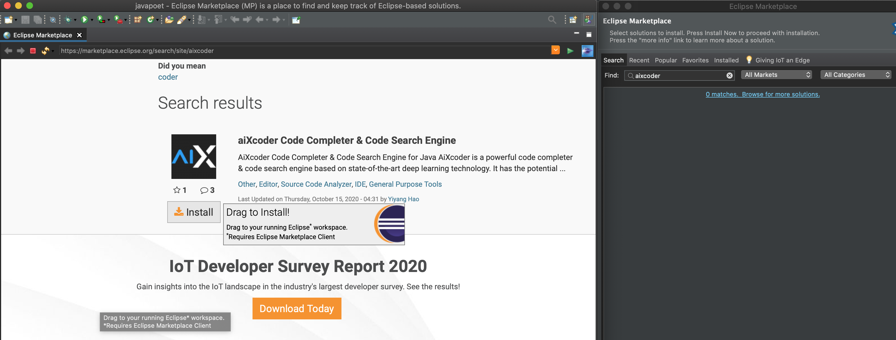

# Quick Start for aiXcoder

This repository is a tutorial for beginners. It could help you get familiar with aiXcoder quickly.

This tutorial has 5 parts:

- [What is aiXcoder?](#what-is-aixcoder)
- [Where to get aiXcoder?](#where-to-get-aixcoder)
  - [IntelliJ for Java](#intellij-for-java)
  - [Eclipse for Java](#eclipse-for-java)
  - [PyCharm for Python](#pycharm-for-python)
  - [VS Code for CPP, Python, JavaScript, TypeScript](#vs-code-for-cpp--python--javascript--typescript)
- [Usage examples](#usage-examples)
- [Uninstalling aiXcoder](#uninstalling-aixcoder)
- [General questions (FAQ)](./FAQ.md)

### What is aiXcoder?

AiXcoder is an AI-based software development assistant tool. 

AiXcoder 2.0 is the first deep-learning-based code completion engine that runs on your local computer. It uses a new powerful deep learning model to improve both accuracy and efficiency. Due to all calculations are performed locally,  aiXcode ensures the security of your code.

### Where to get aiXcoder?

AiXcoder 2.0 is very easy to download and install from the mainstream IDE's Marketplace. 

#### IntelliJ for Java

Open "Preferences" from the IntelliJ IDEA menu. Go to "Plugins" tab and select "Marketplace", and then search for "aiXcoder" to install.

#### Eclipse for Java

Click "Help" from the Eclipse menu and select "Eclipse Marketplace". Search "aiXcoder",  Click "Browse for more solutions".

On a new page, we will see aiXcoder plugin. Drag to Eclipse workspace, it will be installed.

#### PyCharm for Python

Open "Preferences" from the PyCharm menu. Go to "Plugins" tab and select "Marketplace", and then search for "aiXcoder" to install.

#### VS Code for CPP, Python, JavaScript, TypeScript

Click "Extension" on the left. Search "aiXcoder" and click Install.

### Usage examples

When the aiXcoder plug-in is installed, it will download the aiXcoder server automatically. Depending on the network environment, this process may take 10-30 seconds.

After downloading the aiXcoder server, the IDE will initialize the aiXcoder code completion service. It may take a while to prepare the environment, ie., the model, for the first startup. Users can write code during installation, and aiXcoder will automatically start to provide predictions when it is ready.

AiXcoder 2.0 only gives two suggestions, one for short prediction, the other for long prediction. The short prediction could be a variable name, or some other single "term", that we want to use during the coding process. The long prediction produces a line of code which may construct a piece of code logic.

### Uninstalling aiXcoder

To completely remove aiXcoder from your system, there are two steps to follow.

#### Firstly, uninstall plugins

To uninstall aiXcoder, you can find the installed "aiXcoder Code Completer" on the Plugins tab, and click uninstall.

#### Secondly, remove the server directory

- For Windows, remove all files in "%USREPROFILE%/aiXcoder"
- For MacOS, remove all files in "$HOME/Library/Application Support/aiXcoder", and all files in "~/aiXcooder"
- For Linux, remove all files in "$HOME/aiXcoder"

