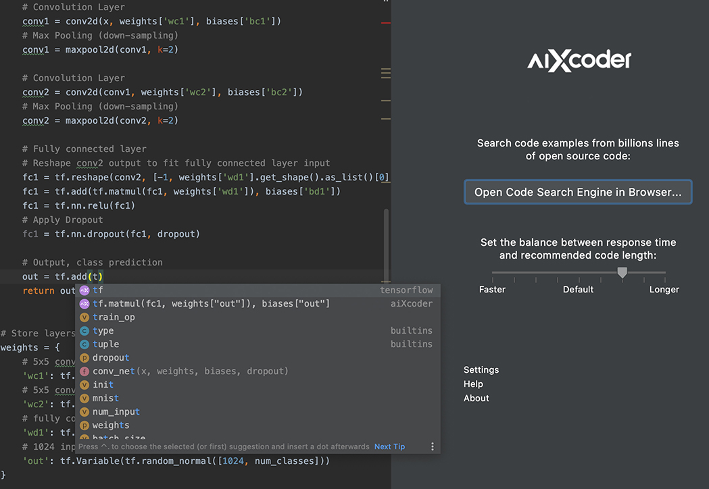

# quick start for aiXcoder

This repository is a tutorial for beginners, who would like to use aiXcoder quickly.

This tutorial can be divided into three parts:

- [What is aiXcoder?](#what-is-aixcoder?)
- [How download it?](#how-download-it)
- [Usage examples](#usage-examples)
- General questions (FAQ)
- [Uninstalling aiXcoder](#uninstalling-aixcoder)

### What is aiXcoder?

aiXcoder is an AI-based software development assistant tool. 

Aixcoder 2.0 is the first deep learning based code completion engine that runs on your local computer. It used a new powerful deep learning model, and the accuracy or speed has been greatly improved. Due to all calculations supported by local cpu, Aixcoder ensures the security of the code.

### How download it?

In IDE's Marketplace, aiXcoder 2.0 is very easy to download and install. 

#### IntelliJ for Java

Open “Preferences” from the IntelliJ IDEA menu. Go to “Plugins” tab and select “Marketplace”, and then search for “aiXcoder” to install.

### Usage examples

When aiXcoder plug-in is installed, it will download the server automatically. Depending on the network environment, this process may take more than ten to thirty seconds.

After the server is downloaded, the IDE will initialize the aiXcoder code completion service. Due to server need to prepare the environment or model for the first startup, and you need to wait a while. Users can write code, and aiXcoder will automatically start to provide predictions when it is ready.

When everything is ok, aixcoder 2.0 only gives two suggestions, one for short prediction, the other for long prediction. Short prediction makes sure the first item is just what we want to use in the coding process, and long prediction produces a line of code which may construct a piece of code logic.

### Uninstalling aiXcoder

To completely remove aiXcoder from your system, there are two steps to follow.

#### Firstly, uninstall plugins

When you want to uninstall aiXcoder, you should find the installed "Aixcoder Code Completer" on the Plugins tab, and click uninstall.

#### Secondly, remove server directory

- For Windows system, remove all files in "%USREPROFILE%/aiXcoder"
- For MacOS, remove all files in "$HOME/Library/Application Support/aiXcoder", and all files in "~/aiXcooder"
- For Linux, remove all files in "$HOME/aiXcoder"

