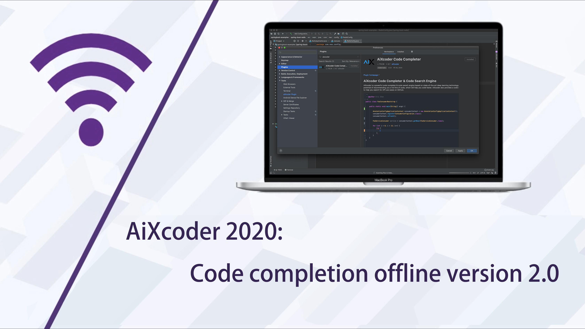
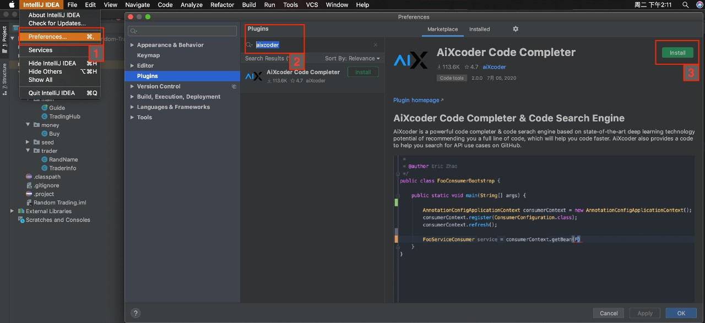
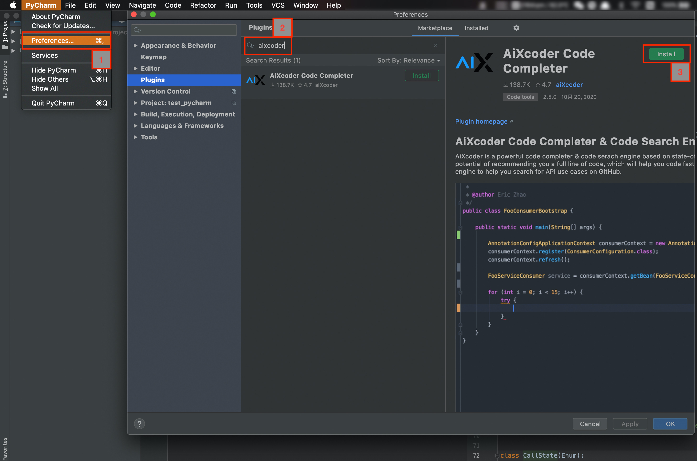
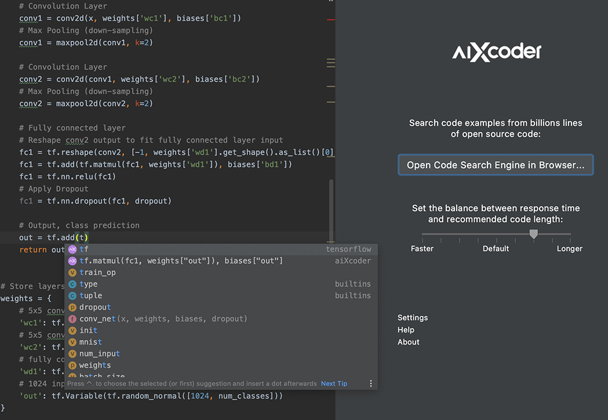
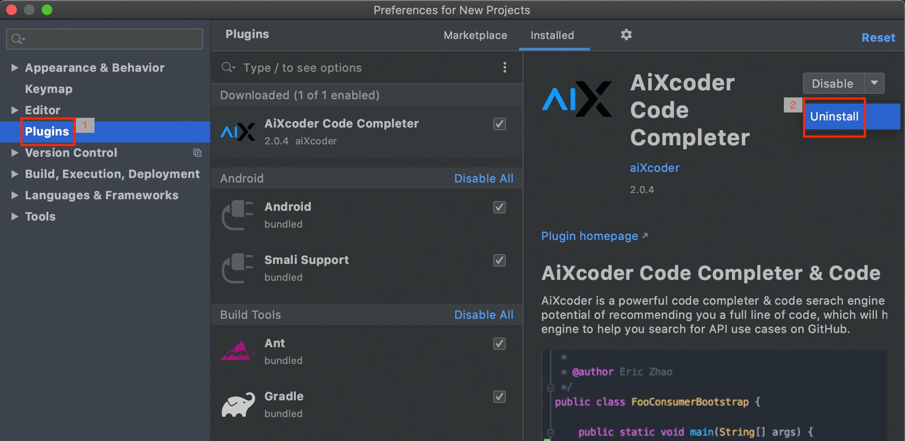

#  aiXcoder 快速上手指南

本文档主要用于快速上手 aiXcoder，它包含以下 5 部分：

- [什么是 aiXcoder](#什么是-aiXcoder)
- [如何安装 aiXcoder](#如何安装-aixcoder)
  - [IntelliJ for Java](#intellij-for-java)
  - [Eclipse for Java](#eclipse-for-java)
  - [PyCharm for Python](#pycharm-for-python)
  - [VS Code for CPP, Python, JavaScript, TypeScript](#vs-code-for-cpp--python--javascript--typescript)
- [aiXcoder使用案例](#使用案例)
- [卸载 aiXcoder](#卸载-aixcoder)
- [常见问题 (FAQ)](https://www.aixcoder.com/#/Support)

### 什么是 aiXcoder

aiXcoder致力于将人工智能技术应用于软件开发领域，帮助开发者快速、高效地完成软件开发任务。

aiXcoder代码补全插件，是aiXcoder系列产品中的一款代表性产品。代码补全，即在开发者编写代码时，自动预测下一个词，或下一条语句，并及时推荐给开发者，以提高编码效率和代码规范性。

### 如何安装 aiXcoder

AiXcoder 目前在主流 IDE 的市场上都可以下载安装，它主要支持 Java 和 Python，其它语言也都将于近期发布。

#### IntelliJ for Java

在「IntelliJ IDEA」菜单栏中打开「Preferences」，然后找到「Plugins」选项中的「Marketplace」。在上面搜索「aixcoder」就能找到插件，并直接下载安装。

#### Eclipse for Java

在 Eclipse 菜单栏中点击「Help」，并选择「Eclipse Marketplace」。Marketplace中我们可以搜索「aiXcoder」，如果没有搜索到，可点击「Browse for more solutions」。

Eclipse 会弹出一个新窗口以展示 aiXcoder，将「Install」拖拽到 Eclipse 工作目录就能完成安装。

#### PyCharm for Python

在「PyCharm」菜单栏中打开「Preferences」，然后找到「Plugins」选项中的「Marketplace」。在上面搜索「aixcoder」就能找到插件，并直接下载安装。

#### VS Code for CPP, Python, JavaScript, TypeScript

在 VS Code 左边框「Extensions」的搜索栏中检索「aiXcoder」，搜索到结果点击安装即可。

### 使用案例

当我们在 IDE 安装完 aiXcoder 插件后，它会自动下载aiXcoder后端服务。一般根据网络状况，需要花 10 到 30 秒的时间完成下载。

等后端服务下载完成，IDE 会初始化 aiXcoder 代码补全引擎，包括加载模型等等，这大概需要十多秒。在这过程中，我们可以正常编写代码，等 aiXcoder 服务准备好后，它会自动出现代码推荐。

如果正常安装，aiXcoder 在编写代码的过程中会给出两条预测，即如上带紫色 logo 的两条。其中第一条为短预测，第二条为长预测，短预测一般为变量名、API 等单个字符串，长预测可以是一整行代码。

AiXcoder 短预测保证准确性，而长预测则尽可能推荐接下来可能完成的代码逻辑。

### 卸载 aiXcoder

如果需要从系统完全移除 aiXcoder，我们需要完成以下两步。

#### 第一步，卸载插件

首先，我们需要在 IDE 的插件界面，选择「Uninstall」已安装的「aiXcoder Code Completer」，如下为 IntelliJ IDEA 的插件界面，其它 IDE 也都有类似界面。

#### 第二步，移除后端服务文件

- 对于 Windows 系统，移除「%USREPROFILE%/aiXcoder」目录下的所有文件；
- 对于 MacOS 系统，移除「$HOME/Library/Application Support/aiXcoder」目录，同时移除「~/aiXcooder」目录；
- 对于 Linux 系统，移除「$HOME/aiXcoder」下的所有文件。

