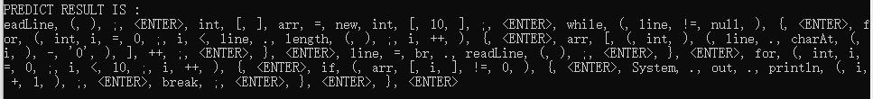

# aiXcoder-XL 调用接口说明

目录

- [aiXcoder-XL 调用接口说明](#aixcoder-xl-调用接口说明)
  - [整体流程](#整体流程)
  - [预测接口](#预测接口)
    - [第一步：预测](#第一步预测)
      - [接口地址](#接口地址)
      - [Header参数说明](#header参数说明)
      - [body参数说明](#body参数说明)
      - [接口备注](#接口备注)
      - [完整的参数示例](#完整的参数示例)
      - [返回值示例](#返回值示例)
      - [CURL的请求示例](#curl的请求示例)
    - [第二步：查询预测结果](#第二步查询预测结果)
      - [接口地址](#接口地址-1)
      - [header参数说明](#header参数说明-1)
      - [body参数说明](#body参数说明-1)
      - [接口备注](#接口备注-1)
      - [CURL请求示例](#curl请求示例)
  - [完整 SHELL 脚本示例](#完整-shell-脚本示例)
  - [完整的 JAVA 代码示例](#完整的-java-代码示例)
  - [完整的 Python 代码示例](#完整的-python-代码示例)

<br />

## 整体流程

<br />


<br />

## 预测接口

<br />

### 第一步：预测

#### 接口地址

**POST**
https://api.aixcoder.com/open/api/v1/predict

<br />

#### Header参数说明

| 参数名       | 样例值                                               | 说明                                      |
| ------------ | ---------------------------------------------------- | ----------------------------------------- |
| Content-Type | application/x-www-form-urlencoded                    | 必须使用x-www-form-urlencoded编码body     |
| ext          | java(Java)                                           | 模型名，需要和body里的ext一致             |
| uuid         | b2a7780b435549f38fa1b9783d824c41                     | 用户的uuid，需要和body里的uuid一致        |
| projectRoot  | d:\aiX  server\aiXserver\testpage-workspace\testproj | 项目根目录，需要和body里的projectRoot一致 |

<br />

#### body参数说明

| 参数名            | 样例值                                                       | 说明                                                         |
| ----------------- | ------------------------------------------------------------ | ------------------------------------------------------------ |
| nosamode          | true                                                         | （内部参数不用更改）                                         |
| correction_mem    | false                                                        | （内部参数不用更改）                                         |
| correction_chars  | false                                                        | （内部参数不用更改）                                         |
| needSortResult    | false                                                        | （内部参数不用更改）                                         |
| uuid              | test                                                         | 用户的唯一ID                                                 |
| project           | testproj                                                     | 项目名                                                       |
| fileid            | d:\aiX  server\aiXserver\testpage-workspace\testproj\testfile.java | 文件路径                                                     |
| ext:              | java(Java)                                                   | 模型名                                                       |
| projectRoot       | d:\aiX  server\aiXserver\testpage-workspace\testproj         | 项目根目录                                                   |
| text              | import java.io.BufferedReader;  import java.io.FileReader;  import java.io.IOException;     class Solution {         public static void main(String[] args) throws IOException {        String fileName = args[0];        BufferedReader br = new BufferedReader(new FileReader(fileName));        String line = br.r | 光标前的所有文本                                             |
| laterCode         | }  }                                                         | 光标后面的文本，一直到文件结束                               |
| stop_all          | false                                                        | false禁用所有停止条件，true启用所有停止条件                  |
| stop_scopeEnd     | true                                                         | true表示在当前区块结束时停止预测                             |
| insideMethod      | true                                                         | true表示当前光标在函数内，false表示不在，在stop_scopeEnd为true时生效。 |
| ngen              | 500                                                          | 允许本次生成的最大token数量                                  |
| needSortResult    | false                                                        | 是否需要对结果预测结果进行排序                               |
| continuousPredict | true                                                         | 异步的方式进行预测，后续需要调predict_continous接口进行判断并获取结果 |

<br />

#### 接口备注

取结果的id字段，然后再调用predict_continuous获取最终的结果。

<br />

#### 完整的参数示例

```

uuid: test
project: testproj
createFile: true
nosamode: true
correction_mem: false
correction_chars: false
laterCode: 
    }
}
fileid: d:\aiX server\aiXserver\testpage-workspace\testproj\testfile.java
ext: java(Java)
projectRoot: d:\aiX server\aiXserver\testpage-workspace\testproj
text: import java.io.BufferedReader;
import java.io.FileReader;
import java.io.IOException;

class Solution {

    public static void main(String[] args) throws IOException {
        String fileName = args[0];
        BufferedReader br = new BufferedReader(new FileReader(fileName));
        String line = br.r
stop_all: false
stop_scopeEnd: true
insideMethod: true
ngen: 500
needSortResult: false
continuousPredict: true

```

<br />

#### 返回值示例

```

[{
......//其它字段
		"tokens": [     //推荐结果字段
			"eadLine",
			"(",
			")",
		],
		"contPredEnded": false,
		"id": "24608",
	}
......//其它字段
]

```

<br />


#### CURL的请求示例

```bash

curl -X POST 'https://api.aixcoder.com/open/api/v1/predict' \
-H 'Content-Type: application/x-www-form-urlencoded' \
-H 'ext: java(Java)' \
-H 'uuid: b2a7780b435549f38fa1b9783d824c41' \
-H 'projectRoot: d:\aiX server\aiXserver\testpage-workspace\testproj' \
--data-urlencode 'nosamode=true' \
--data-urlencode 'correction_mem=false' \
--data-urlencode 'correction_chars=false' \
--data-urlencode 'needSortResult=false' \
--data-urlencode 'uuid=b2a7780b435549f38fa1b9783d824c41' \
--data-urlencode 'project=testproj' \
--data-urlencode 'fileid=d:\aiX server\aiXserver\testpage-workspace\testproj\testfile.java' \
--data-urlencode 'ext=java(Java)' \
--data-urlencode 'projectRoot=d:\aiX server\aiXserver\testpage-workspace\testproj' \
--data-urlencode 'text=import java.io.BufferedReader;
import java.io.FileReader;
import java.io.IOException;

class Solution {

    public static void main(String[] args) throws IOException {
        String fileName = args[0];
        BufferedReader br = new BufferedReader(new FileReader(fileName));
        String line = br.r' \
--data-urlencode 'laterCode=
    }
}' \
--data-urlencode 'stop_all=false' \
--data-urlencode 'stop_scopeEnd=true' \
--data-urlencode 'insideMethod=true' \
--data-urlencode 'ngen=500' \
--data-urlencode 'saForceWait=true'

```
 
<br />

### 第二步：查询预测结果

<br />

#### 接口地址

**POST**
[https://api.aixcoder.com/open/api/v1/predict_continuous](https://api.aixcoder.com/open/api/v1/predict_continuous)

<br />

#### header参数说明

| 参数名       | 样例值                                               | 说明                                      |
| ------------ | ---------------------------------------------------- | ----------------------------------------- |
| Content-Type | application/x-www-form-urlencoded                    | 必须使用x-www-form-urlencoded编码body     |
| ext          | java(Java)                                           | 模型名，需要和body里的ext一致             |
| uuid         | b2a7780b435549f38fa1b9783d824c41                     | 用户的uuid，需要和body里的uuid一致        |
| projectRoot  | d:\aiX  server\aiXserver\testpage-workspace\testproj | 项目根目录，需要和body里的projectRoot一致 |

<br />

#### body参数说明

| 参数名 | 样例值 | 说明                    |
| ------ | ------ | ----------------------- |
| uuid   | test   | 用户的唯一ID            |
| qid    | 24608  | predict接口中返回的ID值 |

<br />

#### 接口备注

如果出现 "contPredEnded":true，说明预测结束，可以退出循环；否则可以等待一段时间，然后再进行重试，直到成功为止。

<br />

#### CURL请求示例

```bash

curl --location --request POST 'https://api.aixcoder.com/open/api/v1/predict_continuous' \
-H 'Content-Type: application/x-www-form-urlencoded' \
-H 'ext: java(Java)' \
-H 'uuid: b2a7780b435549f38fa1b9783d824c41' \
-H 'projectRoot: d:\aiX server\aiXserver\testpage-workspace\testproj' \
--data-urlencode 'uuid=b2a7780b435549f38fa1b9783d824c41' \
--data-urlencode 'qid=24595'

```

<br />

## 完整 SHELL 脚本示例

```bash
#!/bin/bash 
# 变量定义
URL_PREDICT_BASE='https://api.aixcoder.com/open/api/v1/'
USER_UUID='test'

### 数据预测，由于结果可能很大，所以采用异步的方式，后续需要定期的进行结果获取
echo 'predict api'
PREDICT_RESP_BODY="$(curl -X POST $URL_PREDICT_BASE/predict \
-H 'Content-Type: application/x-www-form-urlencoded' \
-H 'ext: java(Java)' \
-H "uuid: $USER_UUID" \
-H 'projectRoot: d:\aiX server\aiXserver\testpage-workspace\testproj' \
--data-urlencode 'nosamode=true' \
--data-urlencode 'correction_mem=false' \
--data-urlencode 'correction_chars=false' \
--data-urlencode 'needSortResult=false' \
--data-urlencode "uuid=$USER_UUID" \
--data-urlencode 'project=testproj' \
--data-urlencode 'fileid=d:\aiX server\aiXserver\testpage-workspace\testproj\testfile.java' \
--data-urlencode 'ext=java(Java)' \
--data-urlencode 'projectRoot=d:\aiX server\aiXserver\testpage-workspace\testproj' \
--data-urlencode 'text=import java.io.BufferedReader;
import java.io.FileReader;
import java.io.IOException;

class Solution {

    public static void main(String[] args) throws IOException {
        String fileName = args[0];
        BufferedReader br = new BufferedReader(new FileReader(fileName));
        String line = br.r' \
--data-urlencode 'laterCode=
    }
}' \
--data-urlencode 'stop_all=false' \
--data-urlencode 'stop_scopeEnd=true' \
--data-urlencode 'insideMethod=true' \
--data-urlencode 'ngen=500' \
--data-urlencode 'continuousPredict=true')"

PARAM_CONT_PRED_ENDED="$(echo $PREDICT_RESP_BODY | \
    python -c "import sys, json; sys.stdout.write(str(json.load(sys.stdin)[0]['contPredEnded']))"
)"

### 如果contPredEnded字段的值为False，表示当前还不是最终的推荐结果，还需要进一步的查询并获取结果
if [ $PARAM_CONT_PRED_ENDED == 'False' ];then
    ##获取QID参数
    PARAM_QID="$(echo $PREDICT_RESP_BODY | \
        python -c "import sys, json; sys.stdout.write(json.load(sys.stdin)[0]['id'])"
    )"

    echo "predict_continuous api"
	### 如果contPredEnded字段的值为False，则一直进行循环调用
    while [ $PARAM_CONT_PRED_ENDED == 'False' ]
    do
        PREDICT_CONTINUOUS_RESP="$(curl -X POST $URL_PREDICT_BASE/predict_continuous \
            -H 'Content-Type: application/x-www-form-urlencoded' \
            -H 'ext: java(Java)' \
            -H "uuid: $USER_UUID" \
            -H 'projectRoot: d:\aiX server\aiXserver\testpage-workspace\testproj' \
            --data-urlencode "uuid=$USER_UUID" \
            --data-urlencode "qid=$PARAM_QID")"
        PARAM_CONT_PRED_ENDED="$(echo $PREDICT_CONTINUOUS_RESP | \
            python -c "import sys, json; sys.stdout.write(str(json.load(sys.stdin)['contPredEnded']))"
        )"
		### 这块可以SLEEP一段时间，减少对服务器的压力
		#echo $PARAM_CONT_PRED_ENDED
    done
    ### 输出结果列表
    PARAM_TOKENS="$(echo $PREDICT_CONTINUOUS_RESP | \
        python -c "import sys, json; sys.stdout.write(', '.join(json.load(sys.stdin)['cuts'][0]['tokens']))"
    )"
	echo 'PREDICT RESULT IS : '
    echo $PARAM_TOKENS
else
    ### 输出结果列表
    PARAM_TOKENS="$(echo $PREDICT_RESP_BODY | \
        python -c "import sys, json; sys.stdout.write(', '.join(json.load(sys.stdin)[0]['tokens']))"
    )"
    echo $PARAM_TOKENS
fi

```

<br />

结果信息如下所示：



<br />

## 完整的 JAVA 代码示例


```java

package org.example;

import com.alibaba.fastjson2.JSON;
import com.alibaba.fastjson2.JSONArray;
import com.alibaba.fastjson2.JSONObject;
import okhttp3.*;

import java.io.IOException;
import java.util.HashMap;
import java.util.Map;
import java.util.Objects;

public class Main {
    private static String URL_PREDICT_BASE = "https://api.aixcoder.com/open/api/v1/";
    private static String MEDIA_CONTENT_TYPE = "application/x-www-form-urlencoded";

    private static OkHttpClient okHttpClient;

    public static void main(String[] args) {
        okHttpClient = new OkHttpClient();
        String uuid="test";
        Map<String, Object> valueMap = predict(uuid);
        if (!Boolean.valueOf(valueMap.get("contPredEnded").toString())) {
            String tokens = predict_continuous(uuid, valueMap.get("id").toString());
            System.out.println("PREDICT RESULT : ");
            System.out.println(tokens);
        }
    }

    public static Map<String, Object> predict(String uuid) {
        String url = URL_PREDICT_BASE + "/predict";
        Map<String, String> headers = new HashMap<>();
        headers.put("content-type", MEDIA_CONTENT_TYPE);
        headers.put("ext", "java(Java)");
        headers.put("uuid", uuid);
        headers.put("projectRoot", "d:\\aiX server\\aiXserver\\testpage-workspace\\testproj");

        Map<String, Object> bodies = new HashMap<>();
        bodies.put("nosamode", true);
        bodies.put("correction_mem", false);
        bodies.put("correction_chars", false);
        bodies.put("needSortResult", false);
        bodies.put("uuid", uuid);
        bodies.put("project", "testproj");
        bodies.put("fileid", "d:\\aiX server\\aiXserver\\testpage-workspace\\testproj\\testfile.java");
        bodies.put("ext", "java(Java)");
        bodies.put("projectRoot", "d:\\aiX server\\aiXserver\\testpage-workspace\\testproj");
        bodies.put("text", "import java.io.BufferedReader;\n"
                + "import java.io.FileReader;\n"
                + "import java.io.IOException;\n"
                + "class Solution {\n"
                + "    public static void main(String[] args) throws IOException {\n"
                + "        String fileName = args[0];\n"
                + "        BufferedReader br = new BufferedReader(new FileReader(fileName));\n"
                + "        String line = br.r");
        bodies.put("laterCode", "\n    }\n"
                + "}");
        bodies.put("stop_all", false);
        bodies.put("stop_scopeEnd", true);
        bodies.put("insideMethod", true);
        bodies.put("ngen", 500);
        bodies.put("continuousPredict", true);

        //接口调用
        String respBody = apiVisit(url, headers, bodies);
        JSONArray jsonArray = JSON.parseArray(respBody);
        JSONObject jsonObject = jsonArray.getJSONObject(0);
        Map<String, Object> valueMap = new HashMap<>();
        boolean contPredEnded = jsonObject.getBoolean("contPredEnded");
        valueMap.put("contPredEnded", contPredEnded);
        if (!contPredEnded) {
            valueMap.put("id", jsonObject.getString("id"));
        } else {
            valueMap.put("tokens", jsonObject.getString("tokens"));
        }
        return valueMap;
    }

    public static String predict_continuous(String uuid, String qid) {
        String url = URL_PREDICT_BASE + "/predict_continuous";
        Map<String, String> headers = new HashMap<>();
        headers.put("content-type", MEDIA_CONTENT_TYPE);
        headers.put("ext", "java(Java)");
        headers.put("uuid", uuid);
        headers.put("projectRoot", "d:\\aiX server\\aiXserver\\testpage-workspace\\testproj");

        Map<String, Object> bodies = new HashMap<>();
        bodies.put("uuid", uuid);
        bodies.put("qid", qid);
        String tokenStr = null;
        do {
            String respBody = apiVisit(url, headers, bodies);
            JSONObject dataContext = JSON.parseObject(respBody);
            // err字段值不为0时，表示有错误信息，需要打印并退出当前查询
            if (!Objects.equals(dataContext.get("err"), 0)) {
                System.out.println("error occurred!");
                System.out.println(respBody);
                break;
            } else if (dataContext.getBoolean("contPredEnded")) {
                tokenStr = dataContext.getJSONArray("cuts").getJSONObject(0).getJSONArray("tokens").toString();
                break;
            }
            // 程序休眠一下，减少接口调用
            try {
                Thread.sleep(100);
            } catch (InterruptedException e) {
                throw new RuntimeException(e);
            }
        } while (true);

        return tokenStr;
    }

    public static String apiVisit(String url, Map<String, String> headers, Map<String, Object> bodies) {
        StringBuilder builder = new StringBuilder();
        bodies.forEach((name, value) -> {
            if (builder.length() != 0) {
                builder.append('&');
            }
            builder.append(URLEncoder.encode(name, "UTF-8"));
            if (value != null) {
                builder.append("=");
                builder.append(URLEncoder.encode(value.toString(), "UTF-8"));
            }
        });
        RequestBody requestBody = RequestBody.create(MediaType.get("application/x-www-form-urlencoded"), builder.toString());
        Request.Builder requestBuilder = new Request.Builder().url(url);
        headers.forEach((name, value) -> {
            requestBuilder.addHeader(name, value);
        });
        Request request = requestBuilder.post(requestBody).build();
        try (Response response = okHttpClient.newCall(request).execute()) {
            //判断请求是否成功
            if (response.isSuccessful()) {
                String body = response.body().string();
                // 打印服务端返回结果
                return body;
            }
        } catch (IOException e) {
            e.printStackTrace();
        }
        return null;
    }
}

```

<br />

## 完整的 Python 代码示例

```python

import time
import requests

URL_PREDICT_BASE = "https://api.aixcoder.com/open/api/v1/"
MEDIA_CONTENT_TYPE = "application/x-www-form-urlencoded"
projectRoot = "d:\\Documents\\Code"
PREFIX = ("import java.io.BufferedReader;\n"
          "import java.io.FileReader;\n"
          "import java.io.IOException;\n"
          "class Solution {\n"
          "    public static void main(String[] args) throws IOException {\n"
          "        String fileName = args[0];\n"
          "        BufferedReader br = new BufferedReader(new FileReader(fileName));\n"
          "        String line = br.r")
SUFFIX = ("\n    }\n"
		  "}")

def predict_init(uuid):
    url = URL_PREDICT_BASE + "/predict"
    headers = {
        "Content-Type": MEDIA_CONTENT_TYPE,
        "ext": "java(Java)",
        "uuid": uuid,
        "projectRoot": projectRoot
    }
    bodies = {
        "nosamode": True,
        "correction_mem": False,
        "correction_chars": False,
        "needSortResult": False,
        "uuid": uuid,
        "project": "testproj",
        "fileid": projectRoot + "\\example.java",
        "ext": "java(Java)",
        "projectRoot": projectRoot,
        "text": PREFIX,
        "laterCode": SUFFIX,
        "stop_all": False,
        "stop_scopeEnd": True,
        "insideMethod": True,
        "ngen": 500,
        "continuousPredict": True
    }
    resp = post(url, headers=headers, data=bodies)
    # print(resp)
    # exit()
    respBody = resp.json()[0]
    if respBody['err']:
        print("error occurred! -52")
        print(resp.json())
        exit()
    # exit()
    # print(respBody)
    valueMap = {}
    contPredEnded = respBody["contPredEnded"]
    valueMap["contPredEnded"] = contPredEnded
    if not contPredEnded:
        valueMap["id"] = respBody["id"]
    else:
        valueMap["tokens"] = respBody["tokens"]
    return valueMap


def predict_continuous(uuid, qid):
    url = URL_PREDICT_BASE + "/predict_continuous"
    headers = {
        "content-type": MEDIA_CONTENT_TYPE,
        "ext": "java(Java)",
        "uuid": uuid,
        "projectRoot": projectRoot
    }
    bodies = {
        "uuid": uuid,
        "qid": qid
    }
    tokenStr = None
    while True:
        resp = post(url, headers=headers, data=bodies)
        respBody = resp.json()
        # err字段值不为0时，表示有错误信息，需要打印并退出当前查询
        if respBody["err"] != 0:
            print("error occurred!")
            print(respBody)
            break
        elif respBody["contPredEnded"]:
            tokenStr = respBody["cuts"][0]["tokens"]
            break
        # 程序休眠一下，减少接口调用
        time.sleep(0.1)
    return tokenStr

def urlencode(data):
    s = '&'.join(['%s=%s' % (k, v) for k, v in data.items()]).replace("False", "false").replace("True", "true")
    return s

def post(url, data=None, headers=None):
    if isinstance(data, dict):
        data = urlencode(data)
    return requests.post(url, data=data, headers=headers)


if __name__ == "__main__":
    uuid = "test"
    valueMap = predict_init(uuid)
    contPredEnded = valueMap["contPredEnded"]
    if not contPredEnded:
        qid = valueMap["id"]
        tokenStr = predict_continuous(uuid, qid)
        print(tokenStr)
    else:
        tokenStr = valueMap["tokens"]
        print(tokenStr)


```